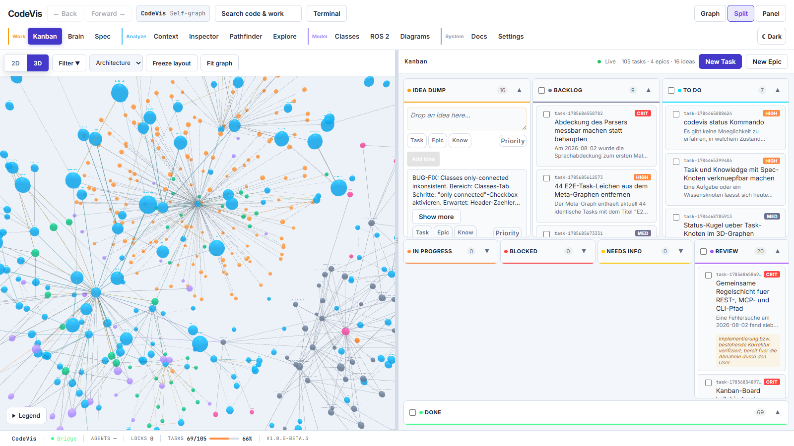
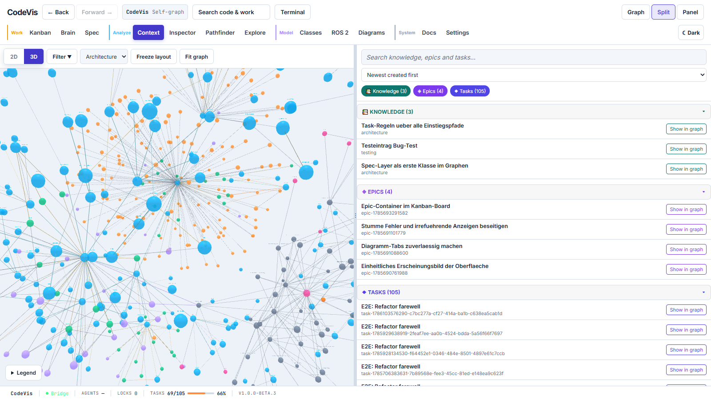
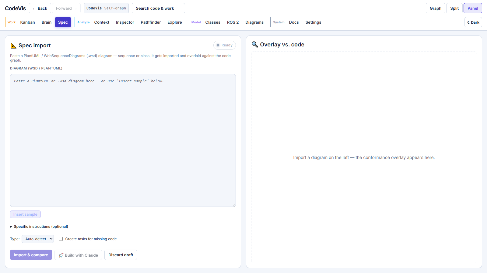
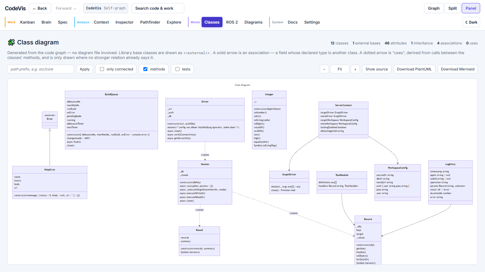
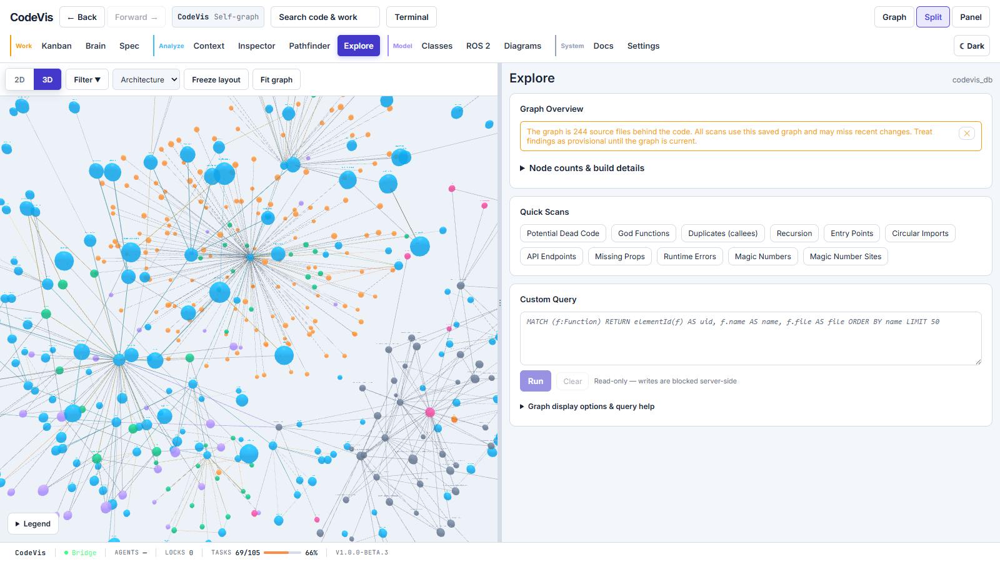
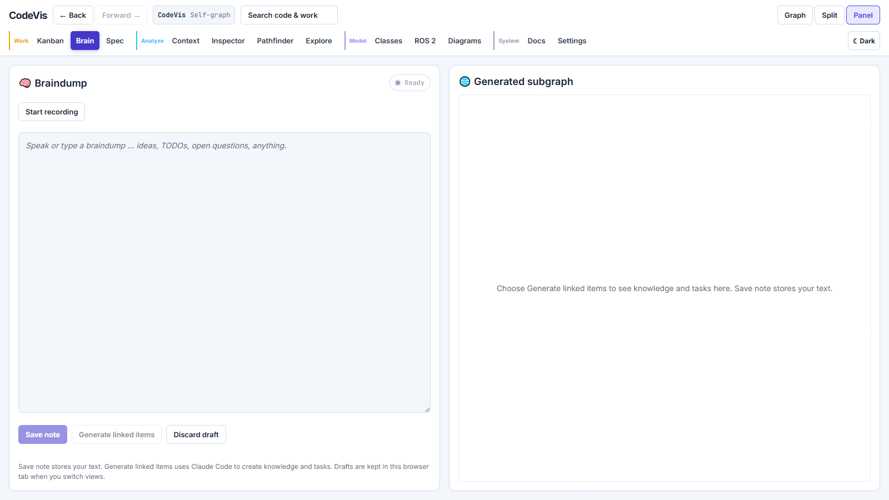
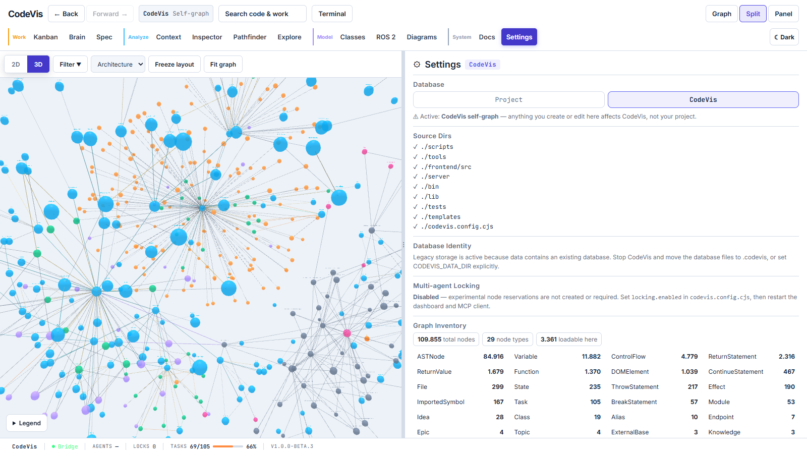
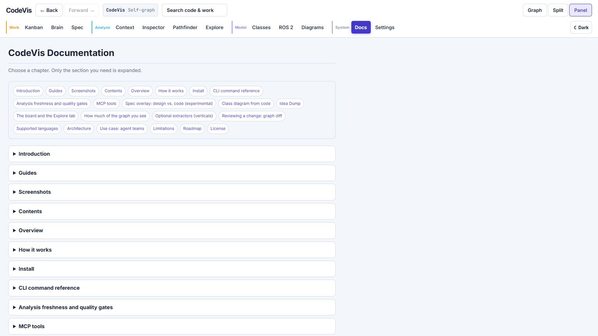

# CodeVis


-blue)


**Your code, tasks, knowledge, and runtime — one queryable graph.**

CodeVis stores parsed code structure, tasks, knowledge, and recorded runtime events in an embedded graph. Relationships connect that information to the code it describes:

- a Task `AFFECTS` the functions it touches
- a Knowledge node `APPLIES_TO` the code it constrains
- runtime errors and user events hang off the function that produced them
- a Decision `DERIVES` Knowledge — the *why* sits next to the *what*

Query those relationships together with Cypher:

```cypher
// Which functions are affected by my open critical tasks,
// had runtime errors recently, AND carry a "do not touch" knowledge note?
MATCH (t:Task {status: 'in_progress', priority: 'critical'})-[:AFFECTS]->(f:Function)
WHERE f.lastError IS NOT NULL
MATCH (k:Knowledge)-[:APPLIES_TO]->(f)
RETURN f.name, f.file, t.title, k.name
```

Three ways in and out of the same graph: tree-sitter parsing, a 3D view in the browser, and a "braindump" box where you type or speak a rough idea. Saving braindumps is provider-independent; the optional automatic conversion into linked task, knowledge, and architecture nodes currently requires Claude Code CLI.

The database is embedded ([Ladybug](https://www.npmjs.com/package/@ladybugdb/core), a KuzuDB fork). CodeVis starts a local daemon as the single database writer; no separate database server installation is required.

Status: beta (`1.0.0-beta.4` in this checkout). Core graph, dashboard, and MCP workflows are usable, while APIs and graph schemas may still change before stable 1.0. Multi-agent locking and wave scheduling remain experimental — see [Limitations](#limitations).

## Guides

- [Documentation map](docs/README.md)
- [User workflow](docs/USER_WORKFLOW.md)
- [Back and Forward navigation](docs/NAVIGATION.md)
- [Database names](docs/DATABASE_NAMES.md)
- [Context workflow](docs/CONTEXT_WORKFLOW.md)
- [Dead-code and parser limits](docs/DEAD_CODE_AND_LIMITS.md)
- [Parser coverage and roadmap](docs/PARSER_COVERAGE.md)
- [Extractor SDK contract](docs/EXTRACTOR_SDK.md)
- [Regression coverage and remaining gaps](docs/TEST_COVERAGE.md)
- [Product roadmap](docs/PRODUCT_ROADMAP.md)

## Screenshots

Everything below is captured from the running CodeVis dashboard while CodeVis analyses its own repository. Nothing is mocked up. The interface keeps the graph, work views, analysis tools, diagrams, documentation, and terminal in one visual system.

### Work and code in one place

**3D graph + Kanban.** The graph and board remain visible together, while the grouped navigation separates Work, Analyze, Model, and System views. Moving a task updates real graph work items and their code-node relationships.



### Knowledge and design, attached to the code

**Context — project knowledge linked to code.** Search tasks, knowledge, specifications, and related nodes without leaving the graph. Workers receive applicable context when they claim connected work.



**Spec — diagrams checked against reality.** Import PlantUML or `.wsd`, bind participants to code, and reconcile what the design promises with what the implementation contains. Imported specification nodes survive graph rebuilds.



### Generated from the code, not maintained by hand

**Class diagram — generated from code.** Classes, members, inheritance, associations, and constructor dependencies are derived from the graph rather than maintained in a separate diagram file. The view can export PlantUML for further use.



### Asking the graph yourself

**Explore — no agent in the loop.** Counts per label, ready-made scans (potential dead code/no static caller, god functions, duplicates, recursion), and your own Cypher. The query field is read-only; writes are rejected server-side. Note the two separate timestamps: when the graph was last *built*, and how old the newest *source file* in it is. A graph can be minutes old and describe code from six weeks ago — or be badly stale while the code moved on, which is the case worth catching.

Dead-code and God-Function scans remain runnable on a stale graph, with provisional-result warnings. Rebuild before acting on those results. Dead-code results distinguish private no-caller candidates from public APIs, framework entrypoints, callback targets, abstract contracts, and planned stubs. Refactoring candidates combine size, decisions, nesting, parameters, state writes, module spread, and internal fan-out; fan-out by itself is not treated as a God Function.



### From a rough thought to linked nodes

**Brain — turn rough thoughts into linked work.** Type or speak; an agent can extract tasks, knowledge, and architecture and link the result into the live graph.



### Understand what is loaded

**Settings — configuration and graph inventory without guesswork.** Source
directories describe the next build, while the inventory separately reports
the existing database total, currently loadable nodes, and counts for every
node type. This distinction remains visible when a database exists but the next
build has not yet been configured.



**Docs — the README without the wall of text.** A compact chapter index and
collapsed sections keep the documentation scannable; selecting a chapter or an
internal link expands the relevant content.



## Contents

- [Overview](#overview)
- [How it works](#how-it-works)
- [Install](#install)
- [CLI command reference](#cli-command-reference)
- [`codevis info` — the first thing to run when something is off](#codevis-info--the-first-thing-to-run-when-something-is-off)
- [Stopping the daemon: `codevis stop`](#stopping-the-daemon-codevis-stop)
- [Analysis freshness and quality gates](#analysis-freshness-and-quality-gates)
- [MCP tools](#mcp-tools)
- [Class diagram from code](#class-diagram-from-code)
- [The board and the Explore tab](#the-board-and-the-explore-tab)
- [How much of the graph you see](#how-much-of-the-graph-you-see)
- [Optional extractors (verticals)](#optional-extractors-verticals)
- [Reviewing a change: graph diff](#reviewing-a-change-graph-diff)
- [Supported languages](#supported-languages)
- [Architecture](#architecture)
- [Use case: agent teams](#use-case-agent-teams)
- [Limitations](#limitations)
- [Roadmap](#roadmap)
- [License](#license)

## Overview

CodeVis records function calls, imports, render relationships, and state access through static analysis. Tasks and knowledge link to the same code nodes, so the dashboard and MCP tools can inspect code structure alongside project context. See [Limitations](#limitations) for relationships static analysis can miss.

| Information | Representation |
|---|---|
| Code structure | Nodes and relationships extracted with tree-sitter |
| Tasks | `Task-AFFECTS->Function` relationships |
| Knowledge & decisions | `Knowledge-APPLIES_TO->Function` relationships |
| Runtime errors & events | Properties and recorded events linked to functions |
| Agent coordination | Persisted lock properties and task waves; experimental |

## How it works

```
        Code (tree-sitter)          Braindump (text / speech)
               │                              │
               ▼                              ▼
        ┌────────────────────────────────────────────┐
        │         Ladybug embedded code graph         │
        │  File · Function · Component · State ·      │
        │  Effect · Endpoint · Task · Knowledge · …   │
        │  + edges: CALLS · IMPORTS · RENDERS ·       │
        │  WRITES_STATE · APPLIES_TO · AFFECTS · …    │
        └────────────────────────────────────────────┘
               │                              │
               ▼                              ▼
        3D view (browser, live)      MCP server (for agents)
```

Nodes: File, Function, Class, Component, State, Effect, Endpoint, Module, Task, Epic, Knowledge, DiagramClass, Decision, DOMElement.

Edges: CONTAINS, CALLS, IMPORTS, IMPORTS_SYMBOL, INHERITS, RENDERS, PASSES_PROP, READS_STATE, WRITES_STATE, HAS_EFFECT, APPLIES_TO, AFFECTS, TOUCHED, FULFILLED_BY.

`TOUCHED` (edit tool → node, with a timestamp and the tool's name) and `FULFILLED_BY` (Epic → Task) are documentary: they record what happened and are never walked during lock traversal, so grouping work or logging an edit cannot widen the region an agent holds.

Every node also carries `degree` — its edge count across all relationship types, written at the end of each build. Not during: a degree taken mid-build miscounts exactly the nodes whose edges appear late (the cross-file calls), which are the ones worth seeing.

Call resolution across files is conservative: a call only becomes a cross-file edge when the calling file actually imports the target (there's a `File-IMPORTS-File` edge and a matching `IMPORTS_SYMBOL`), not just when the names match. The trade-offs are in [Limitations](#limitations).

## Install

Use any MCP client that can launch a local stdio server, including Claude Code, Codex, or Cursor. `codevis init` currently writes Claude Code configuration automatically; other clients can point at the same MCP command manually. The database is embedded — Ladybug ships prebuilt native binaries for Windows x64, macOS, and Linux, so there's no Neo4j server, no JVM, and nothing to install separately. The daemon starts itself and the schema is created on first run.

### Add CodeVis to a project

Run this in your project root:

```bash
npx codevis init     # setup wizard: source folders, MCP server, hooks
npx codevis build    # build the code graph
# restart Claude Code, then /mcp should list 'codevis_graph'
```

For a project that is still being designed, start without a code graph:

```bash
npx codevis init new
```

Planning mode keeps Kanban, Tasks, Epics, Knowledge and Specs available, but
does not start builds or file watchers. Once source code exists, switch modes
and build it:

```bash
npx codevis init code             # detects src/app/lib/etc.
# or: npx codevis init code --source ./src,./packages
npx codevis build full
```

Restart an already running dashboard after changing the configuration. MCP
graph-update requests pick up the new work mode without restarting the client.
Existing Tasks, Knowledge and Specs survive the first code graph build.

## CLI command reference

This table is also the command overview shown in the dashboard's Docs tab.
Run `codevis help <command>` for the complete options of any command.

| Command | What it does |
|---|---|
| `npx codevis init` | Set up the project (wizard) |
| `npx codevis init new` | Start in planning mode without building or watching code |
| `npx codevis init code` | Switch a planned project to code-graph mode and detect source folders |
| `npx codevis build` | Update the graph incrementally |
| `npx codevis build full` | Rebuild the graph from scratch |
| `npx codevis watch` | Watch configured source directories and run debounced incremental updates |
| `npx codevis build codevis_db full` | Build CodeVis itself into `codevis_db` |
| `npx codevis start` | Start the MCP server manually (stdio) |
| `npx codevis stop` | Stop this project's dashboard **and** daemon cleanly (checkpoints the WAL) |
| `npx codevis dashboard` | Serve the 3D graph + Kanban (`--port N`, `--db NAME`, `--no-open`, `--watch`, `--no-watch`) |
| `npx codevis dashboard --web-shell` | Enable the browser shell for this dashboard process; disabled by default and bound to loopback only |
| `npx codevis kanban` | Show the task board in the terminal (`--watch [seconds]` for live refresh) |
| `npx codevis kanban --web` | Open the task board in the browser |
| `npx codevis diff-graph <ref>` | Compare a branch's code graph against another commit |
| `npx codevis impact <name>` | Explain callers, dependencies, tests and linked project knowledge |
| `npx codevis quality` | Report parser resolution and optionally enforce quality gates |
| `npx codevis info` | Ports, daemon state, database sizes — and what is wrong |

The MCP server talks over stdio and registers with Claude Code or Cursor, which gives the agent direct access to the graph.

`codevis watch` is a debounced incremental compiler, not a loop of full builds.
It reparses changed/new files and the direct dependents identified from the old
graph. Deleted or moved paths are invalidated before their old edges disappear;
clear Function renames retain authored Task/Knowledge links through a unique
body-and-parameters fingerprint. Ambiguous matches are reported and left
unlinked rather than guessed.

### `codevis info` — the first thing to run when something is off

It is a status page, not a log: where this project's data lives, which daemon holds the database, what is listening where, how big each graph is, and whether a build is running right now. Then it names the problems it can see instead of leaving you to spot them.

Successful builds also record the project root and resolved source directories
beside each database. `codevis info` warns about older unverified databases.
The builder stops before writing when the recorded sources belong to a
different workspace. Historical checkouts using `data/` are reported explicitly;
new projects use `.codevis/`.

```
$ npx codevis info

CodeVis
  project          <project-root>
  data dir         <project-root>/.codevis
  config           <project-root>/codevis.config.cjs

Daemon
  preferred port   <derived-port>
  pidfile          pid <pid>, port <derived-port>
  port             pid <pid>, holds DB lock

Bridge
  port             <derived-port>  (running)
  url              http://127.0.0.1:<derived-port>

Databases
  codevis_db       <size>   last written <timestamp>
                   <node counts>
  project_db       <size>   last written <timestamp>
                   <node counts>

Findings
  ! 1 quarantined recovery file(s)
      Recovery artifacts were set aside after earlier WAL replay failures.
      Their presence does not establish current corruption; this diagnostic
      cannot determine which writes, if any, are missing. Preserve these files
      for recovery review: <quarantined-recovery-file>
```

The daemon block is worth reading closely: the port CodeVis *derives* from the project path and the port something is *actually bound to* are printed separately, and so is which process holds the database lock. Most "the graph is broken" reports are one of a handful of states this makes visible at a glance — a daemon that never started, several daemons sharing one data directory where only one holds the lock, a pidfile naming a process that no longer exists, or a workspace that is simply empty.

### Stopping the daemon: `codevis stop`

The daemon checkpoints its write-ahead log periodically (every five minutes by
default), after writes go idle (three seconds by default), and during clean
shutdown. A hard kill skips the shutdown checkpoint. On the next open, Ladybug
attempts WAL replay; if replay fails, CodeVis quarantines the WAL, checkpoint and
shadow recovery files before retrying. Writes that were not checkpointed may be
missing afterward. Existing `*.corrupt-*` files record earlier recovery attempts;
their presence alone does not prove current corruption or quantify lost data.
Preserve them while investigating. Use `codevis stop` for a clean shutdown,
especially on Windows where killing a detached process bypasses signal handlers.

```bash
npx codevis stop
# Dashboard stopped (pid <pid>). Port <derived-port> is free.
# Daemon stopped cleanly (pid <pid>). Databases were checkpointed and closed.
```

It stops the **dashboard first, then the daemon**, and that order is the whole point. Stopping only the daemon reads like "everything is down" and isn't: a running bridge pulls the daemon straight back, so every `codevis stop` was reliably followed by a daemon whose start time was *later* than the stop. And because the dashboard kept its port, the next `codevis dashboard` died with "port already in use" while still opening a browser tab — pointed at the **old** dashboard. That looks like `--db` being ignored rather than like a command that never started.

Both go down over a loopback route rather than a signal. Windows cannot deliver `SIGTERM` to a detached process, and `taskkill` is the hard kill this command exists to avoid: it orphans pty children and closes no drivers. The route runs the same `shutdown()` as Ctrl+C and answers *before* it exits, so the caller can tell "stopped" apart from "nothing was ever listening".

The dashboard port is derived from the project path, so it is a port something else could be using. Only a process that identifies itself as a CodeVis bridge via `/api/status` is stopped; anything else is left alone and reported. A dashboard older than this route answers 404 and gets a sentence saying what to do instead of a generic error.

Clients that are still attached — the MCP server in your editor, another script — will start a replacement daemon within milliseconds, because that is what `ensureDaemon` is for. That is not a failure and the command says so explicitly, naming the new pid: the daemon you asked about did stop and did checkpoint. Stop the clients first if you want the database left closed.

`--force` kills the process if it will not go, and tells you plainly that the log was not checkpointed.

### Upgrading

Nothing to do. A daemon adds tables and columns the schema has grown when it *opens* a database — but it is a background process that happily outlives an upgrade, so a version that stores a new node property used to fail with `Binder exception: Cannot find property …`, partway through a build, after full mode had already emptied the graph. The builder now reconciles the running daemon's schema before it writes anything:

```
[schema] reconciled 'project_db' against the running daemon.
```

The reconcile is additive — tables and columns are created, never dropped, renamed or retyped — so it is a no-op when nothing changed, and it cannot put existing data at risk.

### Run it from this repository

No container, just Node 22.12+. The embedded database means there's nothing else to install — `npm install` and you're running.

```bash
# 1. Dependencies (the native Ladybug prebuilt comes with the install)
npm install
cd frontend && npm install && npm run build && cd ..

# 2. Build the graph. The bigger heap is for full AST indexing; the DB and
#    its schema are created automatically on first run. Takes a few minutes.
NODE_OPTIONS="--max-old-space-size=4096" CODEVIS_PROJECT_DIR="$PWD" npm run update:codevis

# 3. Start the app — the bridge serves the built frontend, so this is the
#    only process you need:
npm run bridge          # use `npx codevis info` to print the derived URL
```

On Windows (PowerShell), set the env vars first instead of prefixing:

```powershell
$env:NODE_OPTIONS = "--max-old-space-size=4096"
$env:CODEVIS_PROJECT_DIR = (Get-Location).Path
npm run update:codevis
npm run bridge
```

For frontend development with hot reload, run `cd frontend && npm run dev` in
a second terminal and use http://localhost:5173 instead.

| Surface | URL |
|---|---|
| App (graph, work, analysis and model views) | path-derived; run `npx codevis info` |
| Frontend dev server (hot reload, optional) | http://localhost:5173 |

"Save note" stores a braindump in the selected database without an AI provider.
"Generate linked items" requires an installed and authenticated Claude Code CLI.
Brain and Spec drafts stay in this browser tab when switching views. Edits made
while a request is pending are preserved; a saved confirmation applies only to
the submitted draft. Generated Brain results belong to the requesting workspace
and run, and failed runs show an error.

Run the test suite with `npm test` (unit tests plus an end-to-end pass over
the real MCP tool chain — the first run builds the graph, so it takes a few
minutes).

A few things that trip people up:

- **Start with `codevis info`.** It prints the project and data directory, the daemon port (derived *and* actually bound), which daemon holds the database lock, the bridge port, database sizes with node counts, and whether a build is running right now — then names the problems it can see. Most "the graph is broken" reports are one of: a daemon that never started, several daemons sharing one database where only one holds the lock, a pidfile pointing at a process that no longer exists, or simply an empty workspace.
- The dashboard port is derived from the project path, not fixed at 4000 — two projects can serve their dashboards side by side. `codevis info` tells you which port this project uses.
- A dashboard that comes up with an empty 3D view usually means the *other* workspace is active: it opens on `project_db` by default, while CodeVis' optional self-graph lives in `codevis_db`. Switch the database in the UI.
- Exit 137 means a process was killed; memory exhaustion is one possible cause. Check the build and operating-system logs. For a confirmed Node heap-limit failure, `NODE_OPTIONS="--max-old-space-size=4096"` raises the JavaScript heap ceiling; it does not cap or fix native database memory use.
- A hard kill can leave an un-checkpointed write-ahead log. If replay fails on the next open, CodeVis quarantines the recovery files and recent writes may be missing. `codevis info` lists historical recovery artifacts; their count alone does not establish the cause or extent of data loss. Use [`codevis stop`](#stopping-the-daemon-codevis-stop).

## Analysis freshness and quality gates

The builder, dashboard freshness checks and impact analysis share source-file discovery. They honor the same `sourceDir`, exclusion globs and test-file rules. Test directories are included when explicitly configured; overlapping source roots are deduplicated. Intentionally excluded files do not make an otherwise current graph stale.

Missing or unreadable sources make freshness unknown, with details in
`graphFreshness.sourceErrors`. Both full and incremental builds stop before
changing code nodes when the source scan is incomplete. Restore access or correct
the configured roots before rebuilding. Discovery skips `.codevis` storage and
stops directory-link cycles while continuing to include linked source trees.

`codevis impact` and MCP `impact` report graph freshness and explicit result limits. If the node budget omits reachable nodes inside the requested depth, the result reports truncation and incomplete test/Knowledge selection. Static impact remains bounded evidence, even when the requested traversal completes.

```bash
npx codevis quality --max-parse-errors 0
npx codevis quality --json
npx codevis quality --write-baseline quality-baseline.json
npx codevis quality --baseline quality-baseline.json --max-regression 2
```

Quality reports include `graphFreshness`; MCP `analysis_quality` returns the same field. The CLI exits with a failed `graph-freshness` gate when the graph is stale or freshness is unknown, even if stored resolution and parse-error counts meet the numeric thresholds. An empty graph without source evidence has unknown freshness. A failed gate leaves an existing baseline file untouched. Build the graph before evaluating changes or saving a new baseline.

Baseline comparisons also fail if a previously measured language disappears or
no longer has a resolution measurement. Malformed baseline values are rejected.
After an intentional change in measured languages, review and explicitly save a
new baseline from a current graph.

Call-resolution percentages measure observed internal callsites, not total language support or runtime reachability. Use `get_workspace_identity` to verify the MCP process's project, then check freshness; process identity alone does not prove that the stored graph reflects the current files. Restart MCP clients and the dashboard after an upgrade so they load the new code. Dashboard and MCP version identifiers come from the package version.

## MCP tools

The main tool groups are:

- **Workspace:** `get_workspace_identity`
- **Analysis:** `project_db`, `codevis_db`, `predefined_queries`, `analysis_quality`, `impact`, `find_path`, `read_function`, `get_knowledge_for_node`, `get_runtime_errors` (`tool_db` and `meta_db` remain deprecated compatibility aliases)
- **Editing:** `edit_code_patch`, `insert_code`, `rewrite_function`, `rollback_edit`, `move_function`, `rename_function`, `multi_file_edit`, `recover_stale_edit`, `update_graph_smart` (`edit_function` remains a deprecated compatibility alias)
- **Knowledge:** `create_knowledge`, `link_knowledge`, `list_knowledge`
- **Semantic annotations:** `propose_annotation`, `list_annotations`
- **Tasks:** `create_task`, `get_task`, `claim_task`, `plan_task_scope`, `expand_task_scope`, `complete_task`, `plan_task_waves`, `list_tasks`, `get_next_task`, `update_task_status`, `add_task_comment`, `sync_task`
- **Epics:** `create_epic`, `list_epics`, `get_epic`, `update_epic`, `add_task_to_epic`, `remove_task_from_epic`, `set_epic_task_order`
- **Waves:** `activate_wave`, `complete_wave`, `move_to_wave`
- **Idea Dump:** `create_idea`, `list_ideas`, `update_idea`, `delete_idea`, `promote_idea_to_task`
- **Locking (experimental):** `lock_subgraph`, `unlock_subgraph`, `check_lock`, `inspect_locked_node`, `list_locks`, `extend_locks`, `release_node`, `approve_release`, `reject_release`, `list_pending_releases`, `force_unlock`
- **Bridge/config:** `get_bridge_config`, `set_bridge_config`
- **Spec overlay (experimental):** `import_spec`, `bind_spec`, `reconcile_spec`
- **Diagrams:** `generate_class_diagram`, `generate_ros_diagram`, `list_ros_interfaces`

`tool_db` and `meta_db` remain deprecated compatibility aliases for
`project_db` and `codevis_db`; new integrations should use the public names.
`update_graph_smart` runs a real incremental build and can take several minutes
on a large self-graph, so MCP clients must allow a correspondingly long tool
timeout. `codevis info` shows whether the build is still running.

Locks use a five-minute lease. A worker doing longer work must explicitly call
`extend_locks` before the lease expires; unrelated MCP calls do not renew it.
This keeps active work safe while allowing the one-minute sweep to recover locks
from crashed workers without manual intervention. `complete_task` releases every
lock in that task's lock group immediately — review no longer holds them.
Locking is experimental and disabled by default. Enable it with
`locking: { enabled: true }` in `codevis.config.cjs` (or override one process
with `CODEVIS_LOCKING=on`). Restart the dashboard and MCP client after changing
the config. With locking disabled, Tasks still create `AFFECTS` links, but no
reservations are planned and edit tools require none.

When enabled, graph selection defaults to depth `0`; file-backed targets claim
their entire file. Wider graph selection is an explicit opt-in. Use
`plan_task_scope` before claiming and `expand_task_scope` for additional files,
including new files. See the [task-scope workflow](docs/USER_WORKFLOW.md#task-edit-scopes).

`predefined_queries` returns a catalog of ready-made Cypher queries (recursion,
classified dead-code candidates, duplicate functions, entry points, cyclomatic
complexity, long functions, large classes, missing props, effect dependencies,
and so on) that you run with `project_db` or `codevis_db`.

For example, the functions with the most outgoing calls:

```cypher
MATCH (f:Function)-[:CALLS]->(c)
RETURN f.name, f.file, count(c) AS calls
ORDER BY calls DESC LIMIT 10
```

## Spec overlay: design vs. code (experimental)

Import a PlantUML / WebSequenceDiagrams diagram (`.wsd`/`.puml`) and lay it over the real code graph to see whether the code actually does what the design says. The diagram becomes a conformance check, not just documentation — because CodeVis already has the `CALLS`, `CONTAINS` and `INHERITS` edges to check against. **Sequence**, **class**, **use-case**, and **activity** diagrams are supported (auto-detected).

The flow (lead/architect tools):

1. `import_spec({ sourceFile: "docs/checkout.wsd", db: "project_db" })` — parse the diagram into a spec subgraph. Participants/classes with an unambiguous exact name match in the code are auto-bound; the rest are reported as needing binding.
2. `bind_spec({ specId, bindings: [{ alias: "DB", target: "OrderRepo" }] })` — confirm the remaining bindings. Unbound nodes never produce false drift; they surface as questions.
3. `reconcile_spec({ specId })` — overlay the spec onto the code and report three regions:
   - **conforms** — the documented relation exists in code ✅ (sequence: a `CALLS` edge; class: the method exists on the class / the `INHERITS` edge exists)
   - **missing** — the diagram requires something the code doesn't have
   - **extra** — the code has something undocumented between two bound nodes (scoped to the diagram, so the rest of the codebase isn't flagged)

   Add `emitTasks: true` to turn the *missing* region into backlog Tasks that the existing worker/wave system can implement.

The Spec tab in the frontend exposes a **"Build with Claude"** button that runs the full import → bind → reconcile → task-creation flow headlessly, using the same brain-worker approach as Braindump. Paste a diagram and get tasks back without typing any Cypher.

Spec nodes live in the graph beside the code and survive `build full`; bindings are stored against stable node uids, so they re-resolve after a rebuild. (Storage uses the single-table Ladybug model — distinct `Spec*` labels, no schema migration.)

## Class diagram from code

The fastest way to understand an unfamiliar codebase is usually its class structure — and that structure is already in the graph, so CodeVis can draw it instead of you reading files to reconstruct it.

```
generate_class_diagram({ format: "mermaid", pathPrefix: "src/core" })
```

What it draws:

- **Classes with their attributes and methods**, each capped (`maxMethods`, default 12) — a class that got truncated says so in the box rather than pretending to be complete.
- **Inheritance**, including bases that live in a library. `class MyNode(rclpy.node.Node)` or `class Foo : public rclcpp::Node` shows the base as an `<<external>>` box, because what a class plugs into is part of the architecture.
- **Associations** — a solid arrow for a field whose declared type is another class.
- **Uses relations** — a dotted arrow derived from calls between two classes' methods, drawn only between classes that inheritance, an association or a `«create»` does not already connect. Two classes that talk constantly get one arrow that says the strongest true thing, not four.

It is language-agnostic: it reads the graph's own vocabulary (`Class`, `CONTAINS`, `INHERITS`, `CALLS`), so every language the builder understands is covered by the same implementation. The bridge serves the same thing at `GET /api/diagram/class` — PlantUML and Mermaid in one response.

PlantUML output round-trips: feed it back through `import_spec` + `reconcile_spec` and the diagram becomes a drift check against the code it came from.

Limits worth knowing: classes are identified by name + file, so two same-named classes in one file are not told apart. Visibility markers, `abstract`/`interface` stereotypes, static members and multiplicities are still missing — see [Roadmap](#full-uml-coverage-for-the-class-diagram-planned).

Two Mermaid quirks the renderer works around, both of which used to reach the browser as a parse error rather than a bad drawing. A colon is Mermaid's own member separator, so a qualified type is emitted dot-separated (`sensor_msgs.msg.LaserScan`); `Download PlantUML` gives you the verbatim signature. And a doubled underscore is read as Markdown emphasis, which silently ate the underscores around every Python `__init__` — they go out as Mermaid's `#95;` entity instead.

## Idea Dump

The Idea Dump is a lightweight scratch column in the Kanban board, shown to the left of Backlog. It exists specifically for half-formed thoughts that are not ready to be tasks.

The workflow:

1. Drop a raw idea — a word, a sentence, a vague instinct — into the Idea Dump column or via MCP:
   ```
   create_idea({ content: "cache invalidation on schema rebuild?" })
   ```
2. Later, tell Claude: "I have ideas in the dump." Claude calls `list_ideas`, reads them, asks follow-up questions, and proposes which ones are worth pursuing.
3. Once a specific idea is understood and agreed on, Claude calls `promote_idea_to_task` with a fully-specified `title`, `description`, and `workInstructions`. The task spec gate still applies here — it enforces quality on the way *out* of the dump, not on the way in.
4. The original idea stays in the graph with `status='promoted'` and a `PROMOTED_TO` edge to the new task, so the origin of every task is traceable.

Ideas are stored in the same embedded graph as tasks and knowledge and survive `build full`. The Idea Dump column in the Kanban board supports inline create, edit, and delete — no modal, no form. Ideas cannot be dragged to task columns; they are a different node type (`:Idea` label, no spec gate, no locks).

Ideas follow the **selected workspace**, like tasks always have. They used to be read from `codevis_db` no matter which database the dashboard was showing, so a board on `project_db` displayed one workspace's tasks beside the other's ideas with nothing saying which column came from where. Writing was worse: an idea noted while looking at `project_db` landed in `codevis_db`, and `promote_idea_to_task` would have carried it across the workspace boundary.

## The board and the Explore tab

The Kanban board is laid out as three full-width rows rather than one sideways-scrolling strip: intake (Idea Dump · Backlog · To Do), in flight (In Progress · Blocked · Needs Info · Review), and Done. Every card carries a checkbox, and every column header selects all of its own cards, so a set of tasks can be moved in one action. A bulk move reports what actually happened (`5 of 8 moved`) instead of failing silently on the ones that did not go through. Task fields are editable on the card itself — no round trip through Cypher or an MCP call to fix a title.

Tasks can be grouped under an **Epic** (`GET/POST /api/epics`, `PUT /api/epics/:id/tasks/:taskId`, plus ordering). The Epic is a node in the same graph, linked to its tasks by `FULFILLED_BY`, and appears in the 3D view like anything else. The edge is documentary and is never walked when locks are traversed: putting two tasks under one epic must not silently widen the region either of them holds.

Done cards — and only done cards — carry a delete button. A task that is still open is the only record that the work exists, so losing it loses the work; a task that is done has already served its purpose. The bridge re-reads the status in the `DELETE /api/tasks/:taskId` handler rather than trusting the client, so the rule holds even if the board and the graph have drifted apart. Deleting also clears the locks keyed to that task: locks hang off a `lockGroup` property rather than an edge, so removing the node alone would strand them on the code nodes for good.

The **Explore** tab answers questions about the graph without going through an agent:

- **Counts** — nodes per label, edges per type, files, when the graph was last built, which extractors are active.
- **Ready-made scans** — potential dead code/no static caller, god functions, duplicates, recursion, entry points. These are the same queries `predefined_queries` exposes over MCP, from one shared module rather than a second copy.
- **Your own Cypher** — with a result table, capped at 500 rows, and the cap is reported rather than silently applied.

The query field is read-only by construction: string literals, comments and quoted identifiers are stripped first, then the remaining structure is checked for write clauses. `MATCH (n) WHERE n.name = "DELETE"` passes; `/*x*/DELETE` does not. A text field in a browser must not be able to write to the graph.

Every result row carries a **Graph** column: one click focuses that node and its direct edges. Return `elementId(n) AS uid` for exact node identity. Legacy `ipv6` columns remain supported, but can match several nodes. Rows that cannot be placed distinguish a missing identity from a node outside the loaded slice.

One number surprises people: Explore counts the whole database (tens of thousands of nodes, most of them AST-level), while the 3D view shows a *slice* of it. What governs that slice is the next section.

## How much of the graph you see

Three things decide what ends up on screen — the **detail level**, the **node budget**, and the **type filter** — and all three now live in one place instead of contradicting each other.

**Detail level** is the vocabulary: `Architecture` (files, functions, components, classes, state, modules, endpoints, tasks, epics, knowledge, the ROS and spec layers), `+ Code detail` for meaningful atomic nodes, `+ Syntax tree` for the raw AST. The slider sits in the ⚙ Settings panel. It had disappeared from the UI entirely for a while — the component was in the repo and rendered by nobody — which put everything past the architecture layer out of reach from the dashboard: 3,139 of 138,698 nodes. The server side had been listening the whole time; nothing was sending.

**The node budget** is a single number *n*, not a list of labels. The bridge spends it **along the edges**: it starts at the best-connected node, walks outward breadth-first, and uses per-type quotas only as a preference for which neighbour to take next. When a component runs dry it restarts at the next unreached hub.

Handing each label its own slice of the budget is the approach that already failed: 494 nodes held together by 101 edges, because a per-type sample has nothing to do with itself — the force layout had nothing to pull on and the view was an empty field of dots. Walking the edges instead, `n=500` returns 500 nodes and 1,186 edges.

Because of that, **switching a type off no longer punches a hole**. The selection goes to the bridge (`POST /api/graph/scope`), the type drops out of the candidate set, and the remaining quotas grow to absorb it — the total stays *n*. Measured: DOM elements off, still 500 nodes, now 1,614 edges.

Nodes with **no edges at all** are unreachable by definition when you walk edges, so they get their own toggle (`No connections`, with a count) and at most a quarter of the budget — loose dots must not crowd out the network. In the scene they wear a grey wireframe cage. It used to be a flat ring, which collapses to a hairline the moment the camera is off-axis, and in a 3D scene the camera is always off-axis to something.

Node **size** comes from the stored `degree`, not from the number of lines actually drawn. A node whose neighbours did not fit in the budget used to render as a leaf, which is precisely backwards: size is supposed to say something about the code, not about the sampling.

The counters say what they measure. `500 of 2,438 loadable at this level — 92,285 in the database` rather than `500 / 500`, and the filter slider and the Settings field write the same budget instead of cropping independently.

Two limits worth knowing: above `MAX_3D_NODES` (4,000) the view falls back to 2D on its own, and the level-3 node cap can be switched off in Settings — `/api/status` reports its state and size so the switch shows what the bridge is doing rather than guessing at it.

Toggling a type used to re-read the entire graph — census, node query, three dozen edge queries, 2.5–4.3 s per click on a 122,000-node graph, for rows that had not changed. A level's candidate set is now fetched once and held: 3.1 s cold, 12 ms warm. The node query deliberately always asks for *all* labels of the level, because a query filtered by the selection would key the cache on the one thing that changes constantly. The cache carries a 10 s TTL on top of event invalidation, since the graph also changes from outside this process (a build in a terminal, an MCP agent writing) — except for locks, which are dropped immediately, because a lock is exactly what someone is watching in real time. Concurrent requests share one load: thirteen clients reconnecting at bridge start used to mean thirteen simultaneous full queries and a 34-second first answer.

## Optional extractors (verticals)

The core is language-neutral: files, functions, calls, classes, imports. On top of that sit *extractors* that understand one ecosystem's idioms. They are switchable per project, because a vertical costs a tree-sitter query pass over every file and writes domain nodes that have no business being in a codebase from a different domain.

```js
// codevis.config.cjs
module.exports = {
  extractors: {
    ros: true,          // ROS 2 nodes, topics, services, actions
  },
  workspaces: { /* ... */ },
};
```

A workspace can override the project-wide setting (`workspaces.project_db.extractors.ros`), which is what you want when one graph is a ROS workspace and the other is not. `codevis init` detects ROS (a `package.xml`, or a source file importing `rclpy`/`rclcpp`) and writes the matching default. A disabled extractor compiles no queries at all — it is off, not filtered afterwards. An unknown name in the block is reported at build time rather than ignored, so a typo cannot silently do nothing.

### ROS 2 architecture

With the ROS extractor on, the graph gains node classes (`rclpy.node.Node` / `rclcpp::Node` subclasses) with the runtime name they pass to their base constructor, plus the topics, services and actions they talk over:

```
generate_ros_diagram({ format: "mermaid" })   # or GET /api/ros/diagram
list_ros_interfaces({ kind: "topic" })        # who publishes /cmd_vel?
```

Names are resolved the way ROS resolves them: a publisher on `cmd_vel` and a subscriber on `/cmd_vel` meet at the same box, and `~/config` becomes `/<node_name>/config`. A name computed at runtime (`self.topic`) is kept and marked rather than dropped, because an interface whose name is dynamic is still an edge in the architecture. Not modelled: namespaces pushed by launch files — those are not parsed, so a node remapped at launch resolves as if it were in the default namespace.

## Reviewing a change: graph diff

A patch shows which lines a branch touched. It cannot show what that did to the structure — which functions appeared, which edges were cut, and above all **which untouched code is now wired to the change**.

```bash
npx codevis diff-graph feat/my-branch                  # against HEAD
npx codevis diff-graph feat/my-branch --base main      # against a specific base
npx codevis diff-graph feat/my-branch --format mermaid --out docs/change.mmd
```

Output has four parts: added/removed/changed nodes, added/removed edges, files, and the **blast radius** — nodes that did not change themselves but gained or lost a connection. An unchanged function that suddenly has a new caller, or lost its only one, appears nowhere in a text diff.

Both sides are built the same way: each commit is checked out into its own `git worktree` and gets a full graph in its own data directory (own daemon, own single-writer lock — your live graph keeps working). Reusing the project's live graph as the base does not work: it is maintained incrementally and still holds nodes for deleted files, which produces hundreds of differences no commit caused.

Worktrees and graphs are cached under `.codevis/diff/<sha>`, so the base is built once and later runs against it are fast. `--rebuild` forces a rebuild, `--clean` removes both caches.

The cache is keyed on the commit **and** on a fingerprint of the builder (the extractor code, the schema, and the active extractor settings). A graph is a function of both: change an extractor and a cached graph from an hour ago is no longer comparable to a fresh one, so the diff would report the builder's evolution as if the branch had caused it. When the fingerprint no longer matches, that side is rebuilt instead of silently compared. In practice this is not a corner case — on the first real run it accounted for 145 of 162 reported edge deletions and two thirds of the blast radius.

Graph diff identity is the normalized natural key (label + name + file), not the
node `uid`. Current code-node uids are deterministic hashes, but they remain an
internal storage detail and may change with builder or schema revisions. A
function that only moved down the file is therefore not reported as
removed-and-added; one whose body grew is.

What this cannot do: judge correctness. A rewritten body with unchanged wiring shows up as a changed node at most. Use it to scope a review, then read the code it points at.

## Supported languages

Full graph (functions, calls, classes/structs where the language has them, and
imports): JavaScript, TypeScript, JSX, TSX, `.cjs`, `.mjs`, Python, C, C++, Go,
Rust, Java, Ruby, Kotlin/Gradle Kotlin (`.kt`, `.kts`), Bash (`.sh`, `.bash`),
and Lua. XML, including Android manifests and resources, is represented as
files plus structural element/attribute AST nodes; XML deliberately creates no
fake functions or calls.

Kotlin analysis also records visibility, `override` methods and common Android
lifecycle/framework entry points. Receiver types inferred from constructor
parameters and properties improve calls such as `repository.load()` without
pretending that dynamic dispatch is fully resolved. Android manifest components
are marked as framework entry points, so the dead-code scan can classify them
separately instead of presenting every callback as equally suspicious.

Static analysis remains conservative. Reflection, dependency injection,
framework callbacks, shell commands assembled at runtime, Lua metatables, and
Kotlin/Java virtual dispatch can hide real runtime relationships. A function
reported with no static caller is a review candidate, not proof of dead code.

Python resolves cross-file method calls and imports — `from foo import Bar; Bar().method()` becomes a real `CALLS` edge across files, not just a same-file hit.

C and C++ resolve `#include "foo.h"` — relative to the source file first, then to the project root. Until recently they had no import query at all, which meant no cross-file edge of any kind: the graph fell apart into one island per file. Against the language-neutral core of 17 query kinds, C++ went from 6/17 to 15/17 and C from 4/17 to 12/17. `#include <vector>` is deliberately *not* recorded — a system header is not in your project, and thousands of edges pointing outside it would bury the ones that matter.

Class/type relationships (`INHERITS`, and therefore the class diagram and the
spec class-conformance check): JavaScript, TypeScript, JSX, TSX, Python, C++,
Java, Ruby, Kotlin, Go, and Rust. TypeScript/Java/Kotlin `implements`, Kotlin
delegation, Go embedding, and Rust trait implementations are represented by the
same relationship. A base type from a library becomes an `ExternalBase` node
rather than being dropped. C has no class model to extract.

Graph-aware function rewriting (`rewrite_function`; legacy alias `edit_function`): JavaScript, TypeScript, JSX, TSX, Python.

CSS and HTML don't have a function/call model, so they aren't wired up.

## Architecture

| Layer | Path | Job |
|---|---|---|
| Graph builder | `scripts/graph_builder.js` | tree-sitter to Ladybug, full and incremental |
| MCP server | `tools/mcp_server.ts`, `tools/handlers/` | the tools above |
| Bridge | `server/bridge.js`, `server/query-security.cjs` | REST + WebSocket plus the isolated read-only query guard |
| Frontend shell | `frontend/src/App.jsx`, `frontend/src/components/AppChrome.jsx` | Dashboard orchestration, navigation and full-screen shells |
| Dashboard panels | `frontend/src/components/GraphPanel.jsx`, `DashboardSidePanel.jsx`, `KanbanBoard.jsx` | Graph controls and task/context/inspector views |
| Frontend models | `frontend/src/hooks/`, `frontend/src/graph/`, `frontend/src/pathfinder/` | Reusable state and pure graph/pathfinder presentation logic |
| Renderers | `frontend/src/components/GraphScene.jsx` | Force Graph 2D/3D; pure tooltip/edge rules live in `graph/presentationModel.js` |

The dashboard is split by responsibility rather than kept in one page
component: `App.jsx` owns cross-panel orchestration, hooks own persistent and
realtime state, panels own their layouts, and pure graph/Pathfinder
transformations are independently regression-tested. New panel behavior should
not be added back into `App.jsx`.

Knowledge nodes and the Architect ("book") idea live in the same graph: an Architect or book `DERIVES` a piece of Knowledge, which `APPLIES_TO` code nodes. So architectural rules sit next to the code they apply to, and an agent working a task picks up the relevant ones automatically.

The Inspector sidebar (click any node in the 3D view) lets you read Knowledge and code details. Database-authored Knowledge content is editable there by exact node identity; Markdown Knowledge instead shows the authoritative source file to edit. Task fields (title, description, workInstructions, priority) are editable in the task detail dialog. Edits are written through the bridge.

The tab bar is the same everywhere, and the selected node is shared across all of it — picking a node in one tab and switching to another keeps it selected, so the tabs are views onto one selection rather than separate tools:

| Tab | What it is for |
|---|---|
| 📋 Kanban | Tasks and ideas; drag between columns moves real locks |
| 📚 Context | Conventions and decisions, linked to the code they constrain |
| 🔍 Inspector | The selected node: source, edges, editable Task/Knowledge fields |
| 🧭 Pathfinder | Walk a call tree or find a bounded A→Z route between two nodes |
| 🔭 Explore | Counts, ready-made scans, and your own read-only Cypher |
| 🧠 Brain | Braindump: rough text in, linked task/knowledge nodes out |
| 📐 Spec | Import a diagram, bind it to code, reconcile design against reality |
| 🧩 Classes | Class diagram generated from the code graph itself |
| 🤖 ROS 2 | Nodes, topics, services, actions — only when the ROS extractor is on |
| 📚 Diagrams | The imported diagram library |
| 📖 Docs | This documentation, served by the bridge |
| ⚙ Settings | Database switch, detail level, node budget, layout — and the source dirs |

**Settings** shows the active database, graph detail, node budget, layout and source configuration. Database inventory describes the stored graph separately from the sources configured for the next build. Missing paths and unverified workspace provenance are shown explicitly; `/api/status` exposes the same information.

**Pathfinder** was called *Debug*, which suggested breakpoints and stepping through a running program. It does neither: it walks the static call tree from one node, or finds a bounded shortest route from the selected node to a destination. Calls-only and Calls+Renders routes are available in both directions. The same search is exposed to agents as `find_path`.

Semantic annotations are deliberately separate from parsed facts. An agent can use `propose_annotation` to attach a weighted, evidence-backed tag to an exact node; the Inspector shows its provenance, confidence and weight and lets a user accept or reject it. The proposal never rewrites `CALLS`, `IMPORTS` or repository Markdown Knowledge.

Explore and the MCP database-query tools execute single read-only queries in a database-enforced read-only transaction. Dedicated tools such as `propose_annotation`, `create_task` and `link_knowledge` still write tags and relationships. After upgrading, run `codevis stop` and reconnect/restart your dashboard or MCP client so the daemon loads the new query endpoint; older daemons reject these queries until restarted.

The single-writer daemon is what makes the one-graph story hold together: the embedded database is opened by exactly one process (`server/ladybug-daemon.cjs`), and the bridge, the MCP server, and every script attach to it over loopback HTTP. The first client spawns it; later clients find it via pidfile + health check. No sync jobs, no webhooks, no eventual consistency between your task tracker and your code index — they're rows in the same store.

## Use case: agent teams

Because tasks, locks, and code live in one graph, you can run **several Claude/agent instances against the same codebase at the same time** and coordinate them through it — without them stepping on each other:

- **Different files in parallel:** file-backed scopes claim whole files, including planned new files. Two functions in the same file intentionally conflict because editors replace file contents.
- **The same thing in parallel:** `plan_task_waves` groups tasks whose locked subgraphs don't overlap into waves. Everything in wave 1 runs concurrently; wave 2 starts when wave 1 completes. The Kanban shows each task's wave as a badge.
- **The optional locking flow:** with `locking.enabled: true`, create tasks with explicit `files` or add them with `plan_task_scope`. Plans may overlap. `claim_task` checks and acquires the complete scope and assigns the worker in one database transaction. `expand_task_scope` acquires additional free files atomically.

Use this for supervised coordination. Conflicting expansions return `LOCK_CONFLICT` immediately with `action: "COORDINATE_SCOPE"`; they do not queue, partially acquire, or automatically release unfinished work. A coordinator must arrange a safe checkpoint and explicit handoff.

## Limitations

This is v1, so it's worth being clear about what holds up and what doesn't yet.

Cross-file call resolution is best-effort. A call becomes a cross-file edge only when the calling file imports the target (a `File-IMPORTS-File` edge plus a matching `IMPORTS_SYMBOL`). That's deliberately conservative — it avoids false edges from name collisions — but it leaves calls through re-exports, dynamic imports, or namespace objects like `api.foo()` unresolved. In practice most resolved CALLS edges are within a single file. Don't treat the graph as a complete impact analysis.

`plan_task_waves` and dead-code detection are built on those CALLS edges, so they inherit the same gap. Treat them as a starting point, not proof.

Multi-agent locking is experimental and cooperative. Claim acquisition and task assignment are atomic in the daemon, but leases are not operating-system file locks: arbitrary shell commands, unhooked editors, or clients configured with locking disabled can bypass them. Renew five-minute leases while working. Cross-file edits are not a single filesystem transaction, so keep backups and review changes. Wave plans remain advisory; the live claim check is authoritative.

Braindump output is only as good as the model behind it. Read the generated tasks and knowledge before you build on them.

What is solid: the structural parsing (functions, classes, imports, states, effects, render relationships), the 3D view, the Kanban, the MCP access to the graph, and braindump-to-graph itself.

## Roadmap

The goal is that someone else can install this without an expert setup, with as little friction as possible between "never heard of it" and "I'll keep this."

- Installation in one command, with no separate database service. The embedded Ladybug database replaces the former external database server, so there are no database ports to wire up or additional services to maintain.
- Setup with as few questions as possible. `codevis init` detects source folders and uses defaults, prompting only when it has to.
- Get to something visible (a 3D graph, or "3 duplicate functions found") within about a minute of installing. This is the main thing left to push on.
- Be transparent about what gets written into a project (`.mcp.json`, hooks, agents), with an uninstall that removes it cleanly.
- Fill the cross-edges automatically: more of the runtime profiler's data (errors, user events, DOM state) attached to function nodes out of the box — the cross-edges *are* the point of the one-graph design.

The supported distribution is the npm package and per-project setup through `npx codevis init`. A dedicated Claude Code plugin may be added later, but it is not required for the MCP server or dashboard.

### 3D performance (done)

On large codebases the 3D view used to slow to a crawl. This is now addressed: the renderer auto-switches to 2D at high node counts, caps detail at level 3, and gates sprite rendering — so a graph with tens of thousands of nodes stays interactive. What is loaded in the first place is a connected slice governed by a node budget rather than a per-type sample, and toggling a type is served from a warm cache instead of re-reading the database; see [How much of the graph you see](#how-much-of-the-graph-you-see). The build-side memory ceiling (a clean abort instead of an OOM crash on very large repos) is still planned.

The animated build-up of the net is no longer a fixed one node per 100 ms — that was 83 minutes for 50,000 nodes, an animation nobody watches to the end. It runs at 1–200 nodes per tick, re-read every tick, so it can be adjusted while a build-up is in flight. An edge is drawn only once *both* of its endpoints are in the scene; previously it was inserted as soon as one end appeared and was consumed from the buffer before the other end existed, which left the finished net permanently full of holes.

### Full UML coverage for the class diagram (planned)

The generated class diagram shows what the graph holds: classes, attributes, methods, inheritance, associations from declared field types, and derived usage. Attributes and associations landed once the builder started extracting class members other than methods. What PlantUML can still express and this cannot — visibility markers, `abstract`/`interface` stereotypes, static members, composition vs. aggregation, multiplicities — needs the same kind of parser work. The renderer is the easy half.

### RAM limiter (planned)

On a very large codebase the build can hit the Node heap limit. Planned: a hard ceiling on the build with a clean abort instead of an OOM crash, and a node/edge budget that warns or produces a partial graph past a threshold. The graph builder and database daemon run in separate processes. Memory limits need to account for the builder's JavaScript heap and the daemon's native database allocations.

## License

MIT — see [LICENSE](LICENSE).
